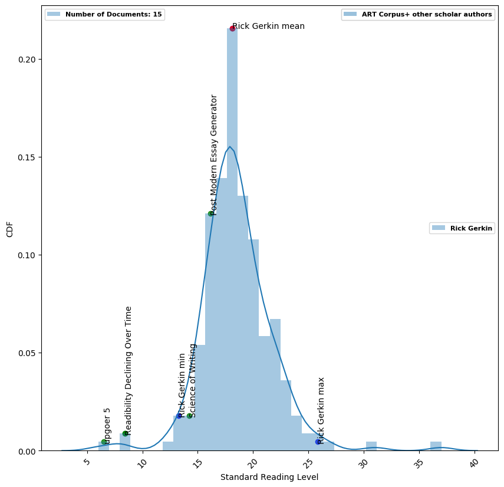



### [Journal of Open Source Software](https://joss.readthedocs.io/en/latest/submitting.html)

# Comparing the Written Language of Scientific and Non-scientific Sources

## Authors
Russell Jarvis, Patrick McGurrin

## Summary
To ensure writing is accessible to a general population, writers must consider the length of written text, as well as sentence structure, vocabulary, and other language features [1]. While popular magazines, newspapers, and other outlets purposefully cater language for a wide audience, there is a tendency for academic writing to use complex, jargon-heavy language [2]. 

In the age of growing science communication, this tendency for scientists to use more complex language can carry over when writing in more mainstream media, such as blogs and social media. This can make public-facing material difficult to comprehend, undermining efforts to communicate scientific topics to the general public.

To address this, we created a tool to analyze complexity of a given scientist’s work relative to other writing sources. The tool first quantifies existing text repositories of defined complexity, which are then used as a reference to contextualize the readability of the user-selected written work. 

We believe this tool uses a data-driven approach to provide insightful, statistical insights to the user about their writing. We hope it will help scientists interested in science communication to make their published work more accessible to a broad audience, and with hope lead to an improved global communication and understanding of complex topics.

## Methods
We built a web-scraping and text analysis infrastructure by extending many existing Free and Open Source (FOS) tools, including Google Scrape, Beautiful Soup, and Selenium.

### Text Metrics to Assess Language Complexity
| Text Metric |   Description of Measurement |
|----------|----------|
| Text-stat                                        | text reading level (complexity) |
| The Natural Language Processing Tool Kit (NLTK)  | text subjectivity and sentiment |
| Search Engine Factors      | records page rank  |
| LZW (de-)compression-ratio | information entropy |
| Cluster centers            | clustering of data when organized using complexity, sentiment, word length and compression  ratios   |

These metrics are combined to formulate a single readability score for each scraped item. 

### Reference Texts used for Analysis
We include a number of available reference texts with varying complexity. 

| Text Source | Mean Complexity | Description |
|----------|----------|:-------------:|
| Upgoer 5 [3]                             | 6   | a library using only the 10,000 most commonly occurring English words |
| Wikipedia                               | 14.9 | a free, popular, crowdsourced encyclopedia   |
| Post-Modern Essay Generator (PMEG) [4]  | 16.5 | generates output consisting of sentences that obey the rules of written English, but without restraints on the semantic conceptual references   |
| Art Corpus [5]                                 | 18.68                           | a library of scientific papers published in The Royal Society of Chemistry |

### Plot Information 
The results of this tool generate a histogram binned by readability score, which is initially populated exclusively by the ART corpus. We use the ART corpus because it is a pre-established library of scientific papers. After entering an author's name, a graph displays the mean writing complexity of this author against a distribution of content from ART corpus.

Upgoer5, Wikipedia, and PMEG libraries are also scraped and analyzed, with their mean readability scores applied to the histogram plot. 

We also include mean readability scores from two scholarly reference papers, Science Declining Over Time [1] and Science of Writing [6],that discuss writing to a broad audience in an academic context. We use these to demonstrate the feasability of discussing complex content using more accessible language.

### Reproducibility
A Docker file and associated container together serve as a self-documenting and extremely portable software environment clone to ensure reproducibility given the hierarchy of software dependencies.

## Results
Data are available here: [Open Science Framework data repository](https://osf.io/dashboard).

### Setting Up the Environment (Developer)
A docker container can be downloaded from Docker hub or built locally.
```BASH
docker login your_user_name@dockerhub.com
docker pull russelljarvis/science_accessibility:slc
mkdir $HOME/data_words
docker run -it -v $HOME/data_words russelljarvis/science_accessibility:slc
```
### Running a Simple Example (User)
After Docker installation on your Operating System, run the following commands in a BASH terminal.
```BASH
docker pull russelljarvis/science_accessibility_user:latest
```
Here is a python example to search for results from academic author Richard Gerkin. When inside the docker container, issue the command:
```BASH
mkdir $HOME/data_words
docker run -v $HOME/data_words russelljarvis/science_accessibility_user "R Gerkin"
```



## Future Work
We have created a command line interface (CLI) for using this tool. However, we aim to expand this to a web application is user friendly to those less familiar with coding. 

In addition, we're interested in general readability of the web, and aim to add search engine queries of different and broad-ranging lists of search terms to assess readability of an eclectic range of text. This would further contextualize the readability of published scientific work with regard to that engaged by the public on a more daily basis.

## Conclusions
In this document, we introduce a tool for exploring the readability of a scientist's published work with regard to other web-based repositories. While other readability tools currently exist to report the complexity of a single document, our work expands upon these tools by contextualizing the complexity of the author's work by comparing it to a variety of other text types. 

We do not intend to compete with these well-established tools. Rather, we aim to apply a more data-driven approach to provide academic authors with statistical insights into their body of published science work, enabling them to monitor the complexity of their writing with regard to other available text types.

## References
[1] Kutner, Mark, Elizabeth Greenberg, and Justin Baer. "A First Look at the Literacy of America's Adults in the 21st Century. NCES 2006-470." _National Center for Education Statistics_(2006).

[2] Plavén-Sigray, Pontus, Granville James Matheson, Björn Christian Schiffler, and William Hedley Thompson. "The readability of scientific texts is decreasing over time." Elife 6 (2017).

[3] Kuhn, Tobias. "The controlled natural language of randall munroe’s thing explainer." International Workshop on Controlled Natural Language. Springer, Cham, (2016).

[4] Bulhak, Andrew C. "On the simulation of postmodernism and mental debility using recursive transition networks." Monash University Department of Computer Science (1996).  

[5] Soldatova, Larisa, and Maria Liakata. "An ontology methodology and cisp-the proposed core information about scientific papers." JISC Project Report (2007).

[6] Gopen, George D., and Judith A. Swan. "The science of scientific writing." American Scientist 78, no. 6 (1990): 550-558.
