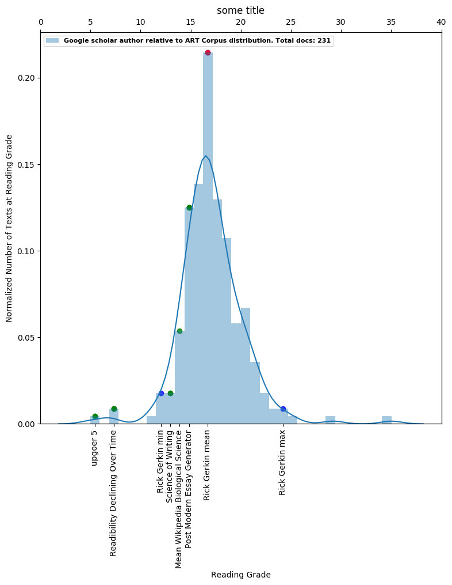

title: 'Exploring the Readability of Scientific and Non-scientific Sources'
		
tags:
  - readability
  - science communication
  - science writing

authors:
  - name: Russell Jarvis
    affiliation: PhD Candidate Neuroscience, Arizona State University
  - name: Patrick McGurrin
    affiliation: National Institute of Neurological Disorders and Stroke, National Institutes of Health
  - name: Shivam Bansal
    affiliation: Senior Data Scientist, H2O.ai
  - name: Bradley G Lusk
    affiliation: Science The Earth; Mesa, AZ 85201, USA
    
date: 20 October 2019

bibliography: paper.bib

## Summary
To ensure that writing is accessible to the general population, authors must consider the length of written text, as well as sentence structure, vocabulary, and other language features [@Kutner:2006]. While popular magazines, newspapers, and other outlets purposefully cater language for a wide audience, there is a tendency for academic writing to use more complex, jargon-heavy language [@Plavén-Sigray:2017]. 

In the age of growing science communication, this tendency for scientists to use more complex language can carry over when writing in more mainstream media, such as blogs and social media. This can make public-facing material difficult to comprehend, undermining efforts to communicate scientific topics to the general public.

To address this, we created a tool to analyze complexity of a given scientist’s work relative to other writing sources. The tool first quantifies existing text repositories with varying complexity, and subsequently uses this output as a reference to contextualize the readability of user-selected written work. 

While other readability tools currently exist to report the complexity of a single document, this tool uses a more data-driven approach to provide authors with insights into the readability of their published work with regard to other text repositories. This will enable monitoring of the relative complexity of their writing, guiding readability improvements to online material. We hope it will help scientists interested in science writing make their published work more accessible to a broad audience, and lead to an improved global communication and understanding of complex topics.

## Methods

### Text Analysis Metrics
We built a web-scraping and text analysis infrastructure by extending many existing Free and Open Source (FOS) tools, including Google Scrape, Beautiful Soup, and Selenium.

We first query a number of available text repositories with varying complexity:

| Text Source | Mean Complexity | Description |
|----------|----------|:-------------:|
| Upgoer 5                            | 6   | library using only the 10,000 most commonly occurring English words |
| Wikipedia                               | 14.9 | free, popular, crowdsourced encyclopedia   |
| Post-Modern Essay Generator (PMEG)  | 16.5 | generates output consisting of sentences that obey the rules of written English, but without restraints on the semantic conceptual references   |
| Art Corpus                       | 18.68  | library of scientific papers published in The Royal Society of Chemistry |

The author's name entered by the user is then queried through Google Scholar, returning the results from articles containing the author's name. 

The Flesch-Kincaid readability score [@Kincaid:1975] - the most commonly used metric to assess readability - is then used to quantify the complexity of all items.

### Plot Information 
The resulting plot is a histogram binned by readability score, initially populated exclusively by the ART corpus [@Soldatova:2007] data. We use this data because it is a pre-established library of scientific papers. 

The mean readability scores of Upgoer5 [@Kuhn:2016], Wikipedia, and PMEG [@Bulhak:1996] libraries are labeled on the plot to contextualize the complexity of the ART corpus data with other text repositories of known complexity. 

We also include mean readability scores from two scholarly reference papers, Science Declining Over Time [@Kutner:2006] and Science of Writing [@Gopen:1990], which discuss writing to a broad audience in an academic context. We use these to demonstrate the feasibility of discussing complex content using more accessible language.

Lastly, the mean reading level of the entered author's work, as well as the maximum and minimum scores, are displayed on the plot. Thus, the resulting graph displays the mean writing complexity of the entered author against a distribution of ART corpus content as these other text repositories of known complexity.

### Reproducibility
A Docker file and associated container together serve as a self-documenting and portable software environment clone to ensure reproducibility given the hierarchy of software dependencies.

## Results
Data are available here: [Open Science Framework data repository](https://osf.io/dashboard).

This tool also allows the entry of two author names to view whose text has the lowest average reading grade level. Public competitions and leader boards often incentivize good practices, and may also help to improve readability scores over time.

## Future Work
We have created a command line interface (CLI) for using this tool. However, we aim to expand this to a web application that is more user friendly to those less familiar with coding. 

The readability of ART Corpus is comparable to that of other scientific journals [2], but incorporating a larger repository of journal articles of various topics, and perhaps even overlaying them on the plot, would nonetheless be beneficial. In addition, adding search engine queries of different, broad-ranging lists of search would also help to further contextualize the readability of published scientific work with regard to topics engaged by the public on a more daily basis.

While the Flesch-Kincaid readability score is the most common readability metric, including other metrics, such as information entropy, word length, and compression ratios, subjectivity, and reading ease scores, will serve to provide more robust feedback to the user with regard to the complexity and structure of their written text.

Finally, we believe that the idea public competition could be a fun and interactive way for scientists to improve their science communication skills, and believe there is room for expansion here as well.

## References
